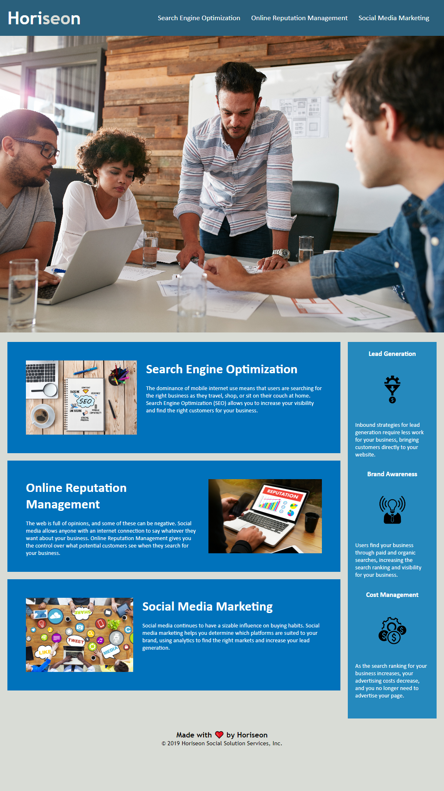

# Project-1

## User Story

This website is a chalange for a bootcamp codign class that is a mock up of a website named "Horiseon" that was to test our ability to recognise how the code and the stylesheet work together and to clean up the code to make it optimal for search engines and follows accesability standards.

## Acceptance Criteria

GIVEN a webpage meets accessibility standards
WHEN I view the source code
THEN I find semantic HTML elements
WHEN I view the structure of the HTML elements
THEN I find that the elements follow a logical structure independent of styling and positioning
WHEN I view the icon and image elements
THEN I find accessible alt attributes
WHEN I view the heading attributes
THEN they fall in sequential order
WHEN I view the title element
THEN I find a concise, descriptive title

## Mock-Up

The following image shows the web application's appearance and functionality:

## Contact

If there are any questions i can be reached via email john.r.klink92@gmail.com

